---

# M1-M2 RabbitMQ Service

## Overview



This repository contains the implementation of two services, M1 and M2, that communicate with each other using RabbitMQ. The M1 service receives HTTP requests, processes them, and sends tasks to the M2 service through a RabbitMQ queue. The M2 service then processes these tasks and sends the results back to M1.

## Features

- **RabbitMQ Integration**: Seamless integration with RabbitMQ for inter-service communication.
- **Rate Limiting**: Protects the service from being overwhelmed by too many requests.
- **Health Check**: Endpoint to check the health status of the services.
- **Error Handling**: Robust error handling and logging mechanism.
- **Configurable**: Centralized configuration loading for easy adjustments.
- **Logging**: Comprehensive logging using Winston with separate logs for errors and combined logs.

## Getting Started

### Prerequisites

- Node.js
- RabbitMQ server

### Local Deployment

1. **Clone the Repository**:
   ```bash
   git clone https://github.com/NilaierMusic/Custom-HTTP-Request-Processing.git
   cd custom_http_request_processing
   ```

2. **Install Dependencies**:
   ```bash
   npm install
   ```

3. **Set Configuration**:
   Configurations are located in the `src/config` folder. To use a specific configuration, set the `NODE_ENV` variable to the name of the desired configuration file (without the `.js` extension).

   - **Windows**:
     ```bash
     set NODE_ENV=configname
     ```

   - **Linux/MacOS**:
     ```bash
     export NODE_ENV=configname
     ```

   Alternatively, you can use a `.env` file placed in the root directory of the project as a fallback or in conjunction with the above method. For more information, check `.env.example` file in repository's docs folder.

4. **Start the Services**:
   - Start M1 service:
     ```bash
     npm run start:m1
     ```
   - Start M2 service:
     ```bash
     npm run start:m2
     ```

5. **Verify**:
   Navigate to `http://localhost:3000/health` (or the port you've configured) in your browser or use a tool like `curl` to ensure the service is running and healthy.

### Testing

Run the tests using the following command:

```bash
npm test
```

## Contributing

Contributions are welcome! Please read the [CONTRIBUTING.md](docs/CONTRIBUTING.md) for details on how to contribute.

## License

This project is licensed under the MIT License. See the [LICENSE.md](LICENSE) file for details.

## Acknowledgments

- [RabbitMQ](https://github.com/rabbitmq/rabbitmq-server) and [Node.js](https://github.com/nodejs/node) communities for their comprehensive [documentation](https://www.rabbitmq.com/documentation.html) and [resources.](https://nodejs.org/en/docs)

---
